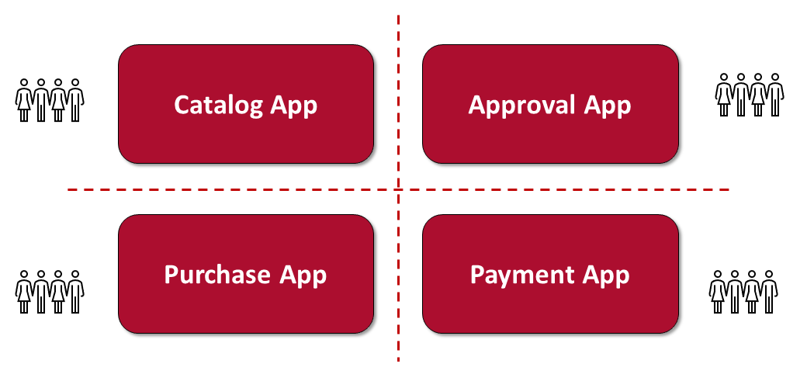
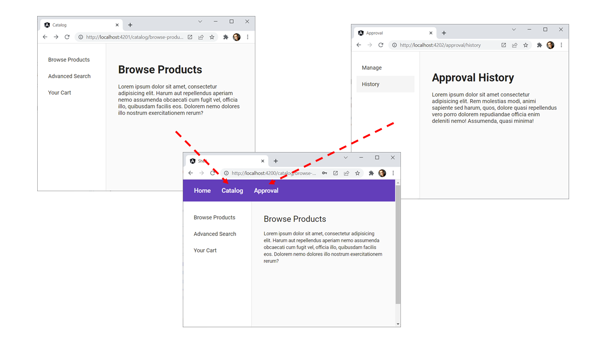
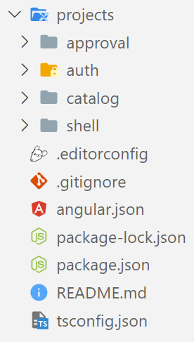
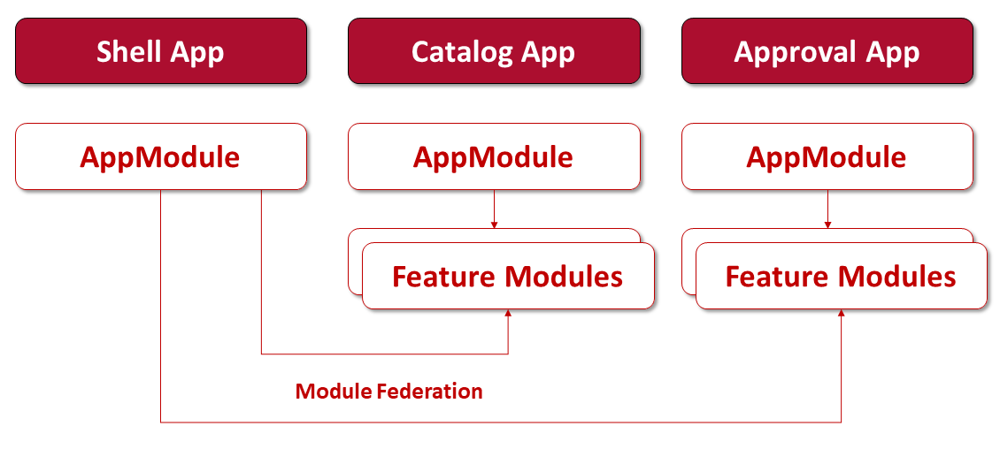
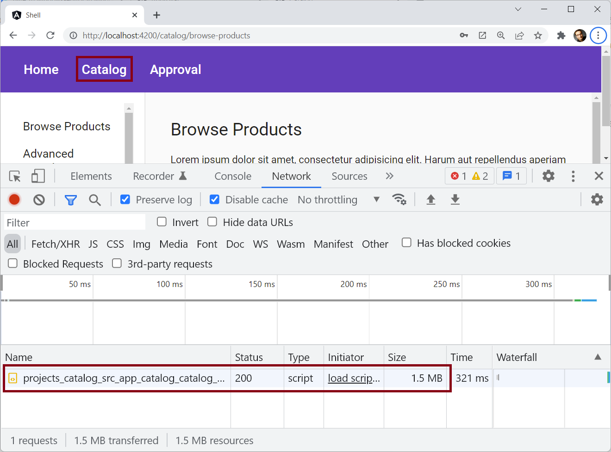
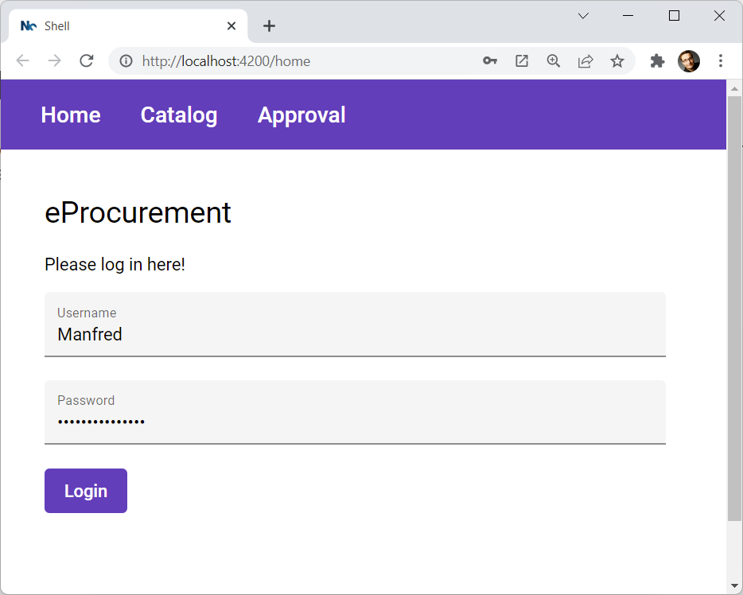
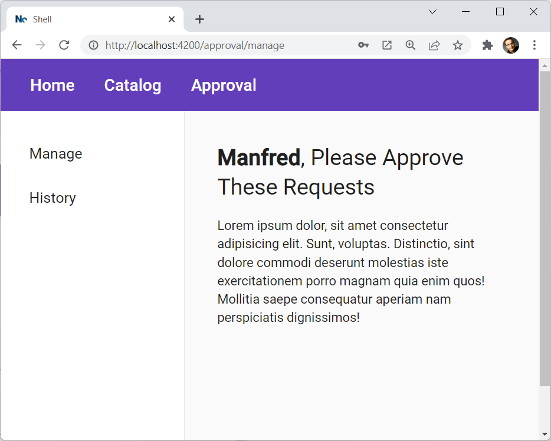

# Module Federation

_Manfred Steyer, GDE_

Nowadays, Micro Frontend architectures are highly discussed. Webpack's Module Federation provides a solid way for building such architectures. As the Angular CLI uses webpack, Module Federation can also be easily used in Angular-based solutions.

This article first gives an overview of Micro Frontends and Module Federation. We also outline some recommendations for using it. Then, we describe how to use Module Federation together with Angular and the CLI.

The [example](https://github.com/manfredsteyer/mf-angular-showcase) used in this article can be found [here](https://github.com/manfredsteyer/mf-angular-showcase).

## Micro Frontend Architectures

The idea behind Micro Frontend architectures is to split a huge frontend into several individual ones. These resulting smaller and hence less complex frontends are called Micro Frontends. For instance, an eProcurement system could consist of the following Micro Frontends:



The main purpose for using such an architecture is to scale teams: Now, a small team can be assigned to each Micro Frontend. These teams can work in an autonomous way and do their own decisions. Most importantly, they can deploy new versions of their Micro Frontend without waiting for or coordinating with other teams. Or, to put it in another way: This architecture helps getting the agility of small teams for large-scale software projects.

To allow the individual teams to work in an autonomous way, each micro frontend typically represents a sub-domain of the business the software system is built for. The borders between these domains should be chosen in a way that prevents use cases from overlapping several domains. While preventing this is not always fully possible, such a situation should be rather the exception than the rule.

Another advantage of Micro Frontend architectures we want to strike out here is the possibility to dramatically decrease build times. As each team only modifies its own micro frontend, they only need to compile their own slice of the overall system. Together with build caches provides by products like [Bazel](https://bazel.build/) or [Nx](https://nx.dev/), this allows to further improve build times.

## Runtime Integration

Splitting large-scale frontends into several smaller ones is only one side of the coin: We also need to find a way to provide an integrated user experience. However, as micro frontends are deployed individually by different teams, integration needs to happen at runtime.

An easy and also solid approach towards runtime integration is connecting several applications via hyperlinks. We find this approach in product suites like Office 365 or the Google platform. Unfortunately, this approach also defeats the advantages of Single Page Applications (SPAs). Hence, hyper-link integration is mainly used in situations where the user sticks for quite a long time with one (Micro) Frontend.

Another approach is providing a shell -- an application that loads the individual Micro Frontends on demand. While this looks a lot like traditional lazy loading, the main difference is that the loaded Micro Frontends are not known at compile time. 

Traditionally, several technical approaches have been used for building shells. Using iframes, loading further SPAs, and loading web components on demand are some popular examples. However, besides some other obvious drawbacks, these approaches demand for a lot of non-trivial infrastructure code for loading and orchestrating different Micro Frontends. Also, they dramatically increase the bundle sizes.

Fortunately, webpack's Module Federation discussed in the next section provides a solid solution for building a shell. 

## Module Federation for Runtime Integration

Module Federation, introduced with webpack 5, helps with runtime integration by allowing to load code from a separately built and deployed application. Basically, it allows to do something like this:

```typescript
const Component = await import('other-app/component');

const NgModule = await import('other-app/ng-module');
```

While we are loading ECMAScript modules from separately built and deployed applications, from Angular's perspective, this looks like lazy loading. That means Angular doesn't even recognize that something special is going on. Module Federation takes care of the heavy lifting underneath the covers. 

This seems to be the biggest advantage of Module Federation: As Angular is not aware of dealing with separately built Micro Frontends, we can use Angular as it is intended to be used. We don't need to tweak Angular in unsupported ways, nor we need any additional infrastructure code for orchestrating different Micro Frontends.

To make all of this possible, Module Federation defines two types of applications:

* **Remotes** are applications that offer some of their ECMAScript modules to other applications. In our case, a Micro Frontend would be such a remote.
  
* **Hosts** load ECMAScript Modules provided by remotes. In our case, the shell is the host.

The following image shows two Micro Frontends that are loaded into a shell:



The Micro Frontends also run in standalone-mode. Hence, they can be developed, debugged and tested in isolation.

Also, Module Federation allows to share libraries at runtime. That means even though the shell and the Micro Frontends are separately compiled, we only need to load Angular, RxJS, and other libraries once. 

Obviously, when sharing libraries at runtime, there can be version mismatches. Fortunately, Webpack Module Federation comes with several strategies for dealing with such situations. However, as a later section will explain, we recommend to prevent them upfront by using a respective code organization.

Unfortunately but also understandably, shared libraries are not tree-shakable: As Micro Frontends are loaded at runtime, we cannot predict upfront which parts of our shared libraries they will use. This will increase the overall bundle size. 

Also, there is another drawback of runtime integration and hence also of module federation: They turn compile time dependencies into runtime dependencies. Hence, we don't know at compile time, if individual Micro Frontends will work together at runtime. This makes E2E tests even more important.

## Monorepos for Organizing Source Code

In general, the Angular team recomments organizing source code in a monorepo -- one code repository that contains all your source code in the form of applications and libraries. While libraries can be reused across different applications they also allow to substructure a huge system in smaller parts.

As all the libraries are co-located in the same repository, they don't need to be versioned and published via a registry. Also, there is always exactly one version of each library. This _ever green version policy_ not only reduces the effort for managing the provided source code but also prevents version conflicts. 

Also, several monorepo implementations allow for restricting yourself to just installing one version per third-party npm package. This self-restriction prevents version conflicts too. 

This all not only sounds interesting in theory but is also an approach heavily and successfully used at Google where there is just one sole monorepo containing all the source code. While this may not be (easily) possible at each company, using a monorepo to substructure and organize a project, a product suite, or several related projects already gives you a fair amount of the advantages outlined. This is something, the author sees in a lot in companies he is consulting. 

However, to succeed with monorepos you need two things: respective processes and respective tooling. The processes, for instance, define how to deal with breaking changes that affect several applications and hence several teams. The tooling helps with tasks like controlling which parts of the monorepo are allowed to access which other parts in order to enforce loosely coupling. 

While loosely coupled libraries are in general vital for an architecture that can evolve, it's one of the fundamental ideas of Micro Frontends: They must not depend on each other in order to allow individual teams to work autonomously. 

Besides this, for succeeding with a mono repo, we also need tooling that allows for incremental builds and tests: As building and testing all applications and libraries contained in a mono repo can be far too time-consuming, such tooling only rebuilds and retests code that has been affected by changes. 

The build system [Nx](https://nx.dev) -- an initiative started by former Angular core team members -- provides all these features and more. As Nx is built on top of the Angular CLI, it feels quite natural to Angular developers: All the known commands like ``ng generate`` or ``ng build`` are still in place and provide additional possibilities needed for enterprise-scale development and monorepos.

Also, Google open-sourced a version of its build tool for managing the huge internal monorepo. While this open version called [Bazel](https://bazel.build/) even allows for more fine grained control over code units compiled separately, it is also more complicated to configure. Also, unlike Nx, it cannot be seen as a drop-in replacement for the Angular CLI.

## Recommendations: When and how to use Micro Frontends and Module Federation?

While building a modular monolith is quite easy with a monorepo, we also see that the Micro Frontend approach provides several advantages for large-scale applications. This architecture is especially interesting when

* different teams need to work in an autonomous way
* compilation times need to be reduced

In these cases Module Federation is a quite tempting technology. However, in order to prevent version mismatches upfront, the Angular team strongly advises to stick with a monorepo. 

The following picture shows a CLI-based monorepo containing a shell, two Micro Frontends (catalog and approval), and a shared library _auth_:



While in general, Module Federation also allows to integrate applications from different repositories and comes with strategies for compensating for version mismatches, we think the possibility of having version mismatches is too risky in the case of Single Page Applications that are downloaded into the browser. This situation is different for Micro Services and server-side rendered web applications: In these cases the concreate frameworks and versions are hidden behind an URL and don't need to be loaded nor executed locally. 

> The author of this document has also helped companies with using multiple repositories. In this case, you trade in a lot of effort for preventing version conflicts by getting additional flexibility. Hence, before moving to multiple repositories one should do a sound evaluation of the consequences of such a decision. 

Even though several Micro Frontends are managed in a monorepo, they can be built and deployed separately. If they share libraries, it's, however, important to always deploy all the changed applications together. If there is a release branch, you at least need to deploy all micro frontends that have been changed there. Otherwise, version conflicts may occur. 

Tools like Nx provide ways to find out about all applications affected by changes. Also, the CI/CD process might use Nx to get this information in order to only deploy the respective micro frontends. As Nx allows for incremental builds, the CI/CD process only needs to build and test affected applications.

<!-- QUESTION: Shall we split this into two parts? If yes, this could be a good position for the split as now we are moving from the concepts to the implementation -->

## Using Module Federation with Angular

After discussing the concepts, now, we are going to demonstrate how to use Module Federation with Angular and the CLI. For this, we assume an CLI-based monorepo with the above shown structure containing the following projects:

* shell app
* catalog app 
* approval app
* auth lib

The catalog and approval apps are our Micro Frontends. The auth lib is a shared library simply storing the current user's name. We are going to use it in a later section.

We also assume, each Micro Frontend has at least one feature module it provides via Module Federation. These feature modules are loaded into the shell:



## Adding the Module Federation Plugin

For getting started, we need to install the Module Federation Plugin: 

```bash
npm i @angular-architects/module-federation --save-dev
```

This plugin is a simple community solution provided by the author and meanwhile also used by Nx. It generates some boilerplate and registers a custom builder that turns on Module Federation before delegating to Angular's default builder.

After installing it, we can use the following calls to activate Module Federation for our projects:

```bash
ng g @angular-architects/module-federation:init --project shell --port 4200

ng g @angular-architects/module-federation:init --project catalog --port 4201

ng g @angular-architects/module-federation:init --project shell --port 4202
```

These commands generate and update several files. For instance, the mentioned builder is registered in the ``angular.json`` and a ``webpack.config.js`` is created for each project. These ``webpack.config.js`` files contain a partial webpack configuration for configuring Module Federation. As usual, the rest is still generated by the Angular CLI.

The next section shows how to adjust these generated configuration files for our needs.

## Configuring Module Federation

The generated webpack configurations define the ECMAScript modules to be provided via the Micro Frontends but also the libraries to share at runtime. The following listing shows the accordingly adjusted ``webpack.config.js`` of the catalog app:

<!-- QUSTION: Shall we show full files or just the parts of the files that are interesting for our discussion here? -->

```javascript
// projects/catalog/webpack.config.js

const ModuleFederationPlugin = require("webpack/lib/container/ModuleFederationPlugin");
const mf = require("@angular-architects/module-federation/webpack");
const path = require("path");
const share = mf.share;

const sharedMappings = new mf.SharedMappings();
sharedMappings.register(
  path.join(__dirname, '../../tsconfig.json'),
  []);

module.exports = {
  output: {
    uniqueName: "catalog",
    publicPath: "auto"
  },
  optimization: {
    runtimeChunk: false
  },   
  resolve: {
    alias: {
      ...sharedMappings.getAliases(),
    }
  },
  experiments: {
    outputModule: true
  },
  plugins: [
    new ModuleFederationPlugin({
        library: { type: "module" },

        name: "catalog",
        filename: "remoteEntry.js",

        // Add EcmaScriptModules to expose:
        exposes: {
            './CatalogModule': './projects/catalog/src/app/catalog/catalog.module.ts',
        },        

        // Add libraries to share:
        shared: share({
          "@angular/core": { singleton: true, strictVersion: true, requiredVersion: 'auto' }, 
          "@angular/common": { singleton: true, strictVersion: true, requiredVersion: 'auto' }, 
          "@angular/common/http": { singleton: true, strictVersion: true, requiredVersion: 'auto' }, 
          "@angular/router": { singleton: true, strictVersion: true, requiredVersion: 'auto' },

          ...sharedMappings.getDescriptors()
        })
        
    }),
    sharedMappings.getPlugin()
  ],
};
```

The comments in this listing mark the two sections we have to take core of:

* **exposes:** key/value pairs with ECMAScript modules that can be loaded into the shell. The keys are short names used by the shell and the values are the full paths pointing to the ECMAScript modules in question.
  
* **shared**: key/value pairs with libraries to share. Here, the keys are the names of the npm packages to share and the values define how to deal with version mismatches. 

In our case, the exposed ECMAScript module provides an Angular module that can be lazy loaded by the Angular router.

The shared libraries contain the Angular libraries we want to share. The assigned objects contain the following properties for controlling version mismatches:

* ``singleton:true``: Defines that only one version of each library is allowed to be loaded. 
  
* ``strictVersion:true``: This makes Module Federation throw a runtime error, when it detects several versions. This tells our integration tests that something went wrong.
  
* ``requiredVersion:'auto'``: Makes Module Federation to use the version numbers provided via the project's ``package.json``.

As we use a monorepo, we shouldn't have version mismatches most of the times. Nevertheless, they can occur when we don't always deploy all the changed applications together. In such a situation, these settings make Module Federation to throw a runtime error so that our integration tests can easily find out about the issue at hand.

Besides these two sections we need to adjust, we also want to draw your attention to two further generated settings:

* **name**: This needs to contain a unique name for the Micro Frontend.
* **fileName**: This is the name of a file with metadata generated by webpack. This file is referred to as the **remote entry point** and  informs the shell about shared libraries. Also, from the location of this file, the shell can infer the locations of the other bundles provided by the Micro Frontend.

Normally, the **remote entry point** is quite a small file with just a few kilobytes in production mode. It should be loaded upfront into the shell so that the shell knows about the shared libraries. The ECMAScript modules exposed by the Micro Frontend, however, are normally just loaded on demand.

<!-- TODO: Also share @angular/material -->

The ``webpack.config.js`` for the approval app is adjusted in a similar way: 

```javascript
// projects/approval/webpack.config.js

const ModuleFederationPlugin = require("webpack/lib/container/ModuleFederationPlugin");
const mf = require("@angular-architects/module-federation/webpack");
const path = require("path");
const share = mf.share;

const sharedMappings = new mf.SharedMappings();
sharedMappings.register(
  path.join(__dirname, '../../tsconfig.json'),
  []);

module.exports = {
  output: {
    uniqueName: "approval",
    publicPath: "auto"
  },
  optimization: {
    runtimeChunk: false
  },   
  resolve: {
    alias: {
      ...sharedMappings.getAliases(),
    }
  },
  experiments: {
    outputModule: true
  },
  plugins: [
    new ModuleFederationPlugin({
        library: { type: "module" },

        // For remotes (please adjust)
        name: "approval",
        filename: "remoteEntry.js",

        // Add EcmaScriptModules to expose:
        exposes: {
            './ApprovalModule': './projects/approval/src/app/approval/approval.module.ts',
        },        
        
        // Add EcmaScriptModules to expose:
        shared: share({
          "@angular/core": { singleton: true, strictVersion: true, requiredVersion: 'auto' }, 
          "@angular/common": { singleton: true, strictVersion: true, requiredVersion: 'auto' }, 
          "@angular/common/http": { singleton: true, strictVersion: true, requiredVersion: 'auto' }, 
          "@angular/router": { singleton: true, strictVersion: true, requiredVersion: 'auto' },

          ...sharedMappings.getDescriptors()
        })
        
    }),
    sharedMappings.getPlugin()
  ],
};
```

Please note that all applications need to opt-in into sharing. Hence you need to adjust the ``shared`` property in all ``webpack.config.js`` files accordingly.

In the shell's ``webpack.config.js`` we just need to make sure that we define the right shared libraries: 

```javascript
// projects/shell/webpack.config.js

const ModuleFederationPlugin = require("webpack/lib/container/ModuleFederationPlugin");
const mf = require("@angular-architects/module-federation/webpack");
const path = require("path");
const share = mf.share;

const sharedMappings = new mf.SharedMappings();
sharedMappings.register(
  path.join(__dirname, '../../tsconfig.json'),
  []);

module.exports = {
  output: {
    uniqueName: "shell",
    publicPath: "auto"
  },
  optimization: {
    runtimeChunk: false
  },   
  resolve: {
    alias: {
      ...sharedMappings.getAliases(),
    }
  },
  experiments: {
    outputModule: true
  },
  plugins: [
    new ModuleFederationPlugin({
        library: { type: "module" },

        // Add EcmaScriptModules to expose:        shared: share({
          "@angular/core": { singleton: true, strictVersion: true, requiredVersion: 'auto' }, 
          "@angular/common": { singleton: true, strictVersion: true, requiredVersion: 'auto' }, 
          "@angular/common/http": { singleton: true, strictVersion: true, requiredVersion: 'auto' }, 
          "@angular/router": { singleton: true, strictVersion: true, requiredVersion: 'auto' },

          ...sharedMappings.getDescriptors()
        })
        
    }),
    sharedMappings.getPlugin()
  ],
};
```

## Lazy Loading from a Micro Frontend

So far, we've configured both, the Micro Frontends as well as the shell. This allows us to lazily load the exposed Angular Modules into our shell via the router:

```typescript
// projects/shell/src/app/app-routing.module.ts

[...]
import { loadRemoteModule } from '@angular-architects/module-federation';
[...]

const routes: Routes = [
  {
    path: '',
    redirectTo: 'home',
    pathMatch: 'full'
  },
  {
    path: 'home',
    component: HomeComponent
  },
  {
    path: 'catalog',
    loadChildren: () => loadRemoteModule({
      type: 'module',
      remoteEntry: 'http://localhost:4201/remoteEntry.js',
      exposedModule: './CatalogModule'
    }).then(esm => esm.CatalogModule)
  },
  {
    path: 'approval',
    loadChildren: () => loadRemoteModule({
      type: 'module',
      remoteEntry: 'http://localhost:4202/remoteEntry.js',
      exposedModule: './ApprovalModule'
    }).then(esm => esm.ApprovalModule)
  },  
  {
    path: 'about',
    component: AboutComponent
  }
];

@NgModule({
  imports: [RouterModule.forRoot(routes)],
  exports: [RouterModule]
})
export class AppRoutingModule { }
```

This routing configuration looks a lot like a traditional one that uses lazy loading. However, instead of a dynamic ``import`` we call the helper function ``loadRemoteModule`` provided by the plugin installed before: 

* **type**: The value ``module`` defines that the Micro Frontends provide its bundles as ECMAScript modules. This is in general the case since Angular 13. For former versions, please skip this parameter or set it to ``script``.
  
* **remoteEntry**: The location of the above discussed remote entry point.

* **exposedModule**: The short name assigned to the exposed module.

As ``loadRemoteModule`` takes the key data pointing to the deployed Micro Frontend, we can change it at runtime with respect to the current environment (e. g. development, staging, production).

> Module Federation also supports dynamic ``import`` statements. However, in this case we needed to define the key data pointing to the Micro Frontends upfront in the ``webpack.config.js``. However, in this case we couldn't exchange the paths depending on the current environment at runtime. Hence, we are going with ``loadRemoteModule`` here.

For routing to different Micro Frontends, the shell's main menu is pointing to these routes:

```html
<mat-toolbar color="primary">
  <button mat-button routerLink="home">Home</button>
  <button mat-button routerLink="catalog">Catalog</button>
  <button mat-button routerLink="approval">Approval</button>
</mat-toolbar>

<div class="content">
  <router-outlet></router-outlet>
</div>
```

## A Little Detail: The New main.ts

Before we start our application, let's have a look to the shell's ``main.ts`` file:

```typescript
// projects/shell/src/main.ts

import('./bootstrap');
```

This ``main.ts`` file was updated by the used Module Federation plugin in order to implement a typical pattern: The ``main.ts`` is just importing another file that bootstraps the application. This ``bootstrap.ts`` contains the usual code we would have expected in the ``main.ts``. The additional indirection is taken on purpose, because Module Federation extends all dynamic imports: Every time, a dynamic import is called, Module Federation loads the needed shared libraries that haven't been loaded so far.

It's a good practice to load the remote entry points containing information about the shared libraries upfront. For this, we can use the helper function ``loadRemoteEntry`` before importing ``bootstrap.ts``:

```typescript
// projects/shell/src/main.ts

import { loadRemoteEntry } from '@angular-architects/module-federation';

Promise.all([
	loadRemoteEntry({ type: 'module', remoteEntry: 'http://localhost:4201/remoteEntry.js'}),
	loadRemoteEntry({ type: 'module', remoteEntry: 'http://localhost:4202/remoteEntry.js'})
])
.then(() => import('./bootstrap'))
.catch(err => console.error(err));
```

## Trying out the Solution

Now, we can try out our solution by starting the Micro Frontends and the shell **side by side**:

```bash
ng serve shell -o
ng serve catalog
ng serve approval
```

After everything started, just click on a menu item pointing to a Micro Frontend, e. g. catalog. This should make Module Federation to lazily load a chunk from this Micro Frontend:



While this looks like lazy loading, the special thing about it is that we are loading this chunk from a different application. In this case, it's even a different origin as the shell and the Micro Frontends use different ports. Having different origins is not a prerequisite, however, it proves that we can indeed load separately built and deployed code.

Also, this screenshot shows that the size of the loaded bundles is quite small. This proves that Angular is shared and not loaded once per Micro Frontend.

## Communication and Sharing Monorepo Libraries

So far we've seen how to share libraries in the form of npm packages. Such libraries can also used for establishing communication between Micro Frontends and the shell: One application can write a value into an object of the shared library and another application can read it. 

> Please note that communication between Micro Frontends couples them to each other. However, coupling is something we want to avoid when deciding for a Micro Frontend architecture. Hence, you should try to communicate as little as possible. Also, you have to make sure that all Micro Frontends can be developed, tested, and deployed in isolation. 

In this section, we want to use our auth library to inform Micro Frontends about the logged-in user. Other then the shared libraries seen so far, the auth library is not an npm package but a library in our monorepo. 

Our implementation allows the user to log in using a form provided by the shell:



After successfully logging in, a shared ``AuthService`` located in the auth library holds the current user name. Hence, other Micro Frontend can read this information:



For the sake of demonstration, the ``AuthService`` is as simple as possible:

```typescript
// projects/auth/src/lib/auth.service.ts

import { Injectable } from '@angular/core';

@Injectable({
  providedIn: 'root'
})
export class AuthService {

  currentUser = '';

  constructor() { }

  login(userName: string, password: string): void {
    this.currentUser = userName;
    // No password check for the sake of demonstration
    // "Login for honest users TM"
  }

  logout(): void {
    this.currentUser = '';
  }
}
```

Also, we need to export this service via the auth library's public API:

```typescript
// projects/auth/src/public-api.ts

export * from './lib/auth.service';
```

Besides this, we use Nx-style path mappings for this library in the ``tsconfig.json`` -- a path mapping directly pointing to the library's source code:

```javascript   
{
  [...]
  "compilerOptions": {
    "paths": {
      "@demo/auth": [
        "projects/auth/src/public-api.ts"
      ]
    },
    [...]
  },
  [...]
}
```

Normally, the CLI creates path mappings pointing to the compiled library in the ``dist`` folder. However, as this forces us into compiling libraries in the right order, we directly point to the source folder.

Fortunately, Module Federation is not only able to share npm packages. It also allows to share source code in an arbitrary folder. However, as this is not that straight forward, the generated ``webpack.config.js`` files use a helper class called ``SharedMappings``:

```javascript
// all webpack.config.js files
const sharedMappings = new mf.SharedMappings();
sharedMappings.register(
  path.join(__dirname, '../../tsconfig.json'),
  ['@demo/auth']);
```

All we need to do is to register the mapped path using the ``SharedMappings``' method ``register``. As each application needs to opt-in into sharing, this registration needs to happen in each ``webpack.config.js`` file.

## Next Step: Using Nx

As mentioned before, [Nx](https://nx.dev/) provides several additional features for working with monorepos and Micro Frontends. Because its foundation is the Angular CLI, it can be seen as a drop-in replacement. For instance, it helps us with the following aspects:

* Restricting the access between the code of different Micro Frontends.

* Visualizing the access paths between applications and libraries.

* Incremental compilation and caching of builds, so that we only need to recompile the changed Micro Frontends. 

* Finding out which applications have been changed. This allows the CI/CD process to find out which Micro Frontends need to be deployed.

If this sounds interesting to you, you find a [tutorial](https://www.angulararchitects.io/aktuelles/tutorial-first-steps-with-nx-and-angular-architecture/) covering all these aspects [here](https://www.angulararchitects.io/aktuelles/tutorial-first-steps-with-nx-and-angular-architecture/).

Nx is also leveraging the here described plugin. Besides enabling Module Federation for an existing application, it also allows to create a new shell and a new Micro Frontend:

```bash
nx g @nrwl/angular:app dashboard --mfe --mfeType=host --routing=true

nx g @nrwl/angular:app login --mfe --mfeType=remote --port=4201 --host=dashboard --routing=true
```

These statements have been taken from the official [Nx documentation](https://nx.dev/guides/setup-mfe-with-angular). The switch ``--mfe`` activates Module Federation and ``--mfeType`` defines the role of the application -- ``host`` for the shell and ``remote`` for a Micro Frontend. The generated applications contain a partial ``webpack.config.js`` we need to adjust as shown above.

## Conclusion

Webpack Module Federation allows to load source code from a separately built and deployed application. This is the key for integrating Micro Frontends at runtime. Module Federation ships with webpack 5+ and hence with CLI 12+. The community plugin ``@angular-architects/module-federation`` allows to active this feature underneath the covers.

In general the Angular team recomments to organize source code in monorepos to establish an evergreen version policy and to avoid version conflicts. If several autonomous teams need to work on the same project, splitting it into Micro Frontends that are integrated with Module Federation is a tempting solution. This also dramatically decreases the build times as now only the changed Micro Frontends need to be recompiled. 

Tools like [Nx](https://nx.dev) also help with such large-scale projects: It allows to restrict the access between source code of different Micro Frontends and hence to decouple them. Also, thanks to it's incremental compilation and a built-in build cache, we don't need to recompile Micro Frontends that haven't been changed. 
